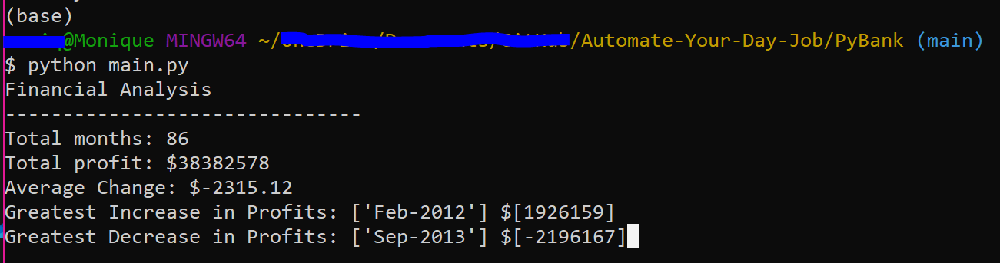

# PyBank

Created a Python script for analyzing the financial records of PyBank with a financial dataset: . This dataset is composed of two columns, Date and Profit/Losses.

Calculated each of the following:
* The total number of months included in the dataset.
* The net total amount of Profit/Losses over the entire period.
* The average of the changes in Profit/Losses over the entire period.
* The greatest increase in profits (date and amount) over the entire period.
* The greatest decrease in losses (date and amount) over the entire period.

Resulting analysis:
